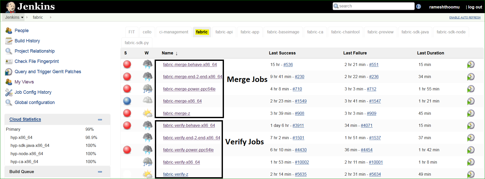
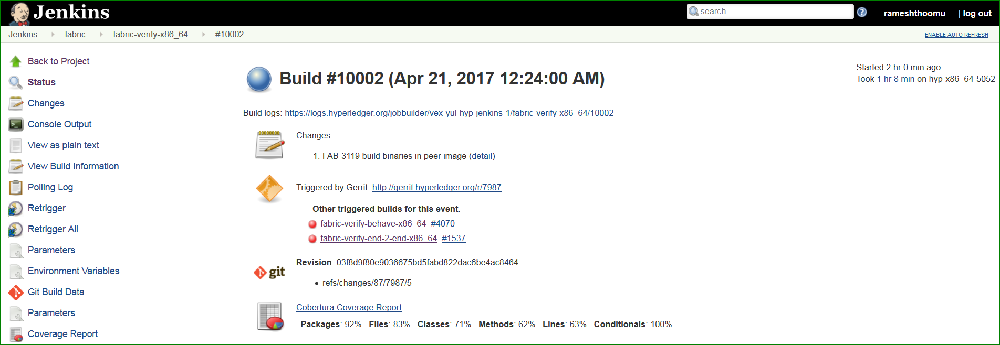

# Hyperledger Fabric CI Process

This repository contains the CI Configuration for all repositories including **fabric, fabric-ca,
fabric-sdk-node, fabric-api,  fabric-busybox,  fabric-sdk-py,  fabric-baseimage, cello,
fabric-chaintool, fabric-app and  fabric-sdk-java**.
All the CI configuration is prepared in Jenkins job builders to create Jenkins Jobs.

As part of the CI process, we create JJB's (Jenkins Job Builder) in YAML format to configure Jenkins jobs.
JJB has a flexible template system, so creating many similarly configured jobs is easy.
More about Jenkins Job Builder is available on [the JJB webpage](https://docs.openstack.org/infra/jenkins-job-builder/).

The following explains what happens when you submit a patch to a
Hyperledger Fabric repository.

## Fabric

When a user submits a patchset to a [fabric](https://gerrit.hyperledger.org/r/#/admin/projects/fabric)
repository, the Hyperledger Community CI server (Jenkins) triggers **verify** jobs on
**x86_64 and s390x** environments and trigger the below jobs

[fabric-verify-x86_64](https://jenkins.hyperledger.org/view/fabric/job/fabric-verify-x86_64/)

[fabric-verify-s390x](https://jenkins.hyperledger.org/view/fabric/job/fabric-verify-z/)

[fabric-verify-end-2-end-x86_64](https://jenkins.hyperledger.org/view/fabric/job/fabric-verify-end-2-end-x86_64/)

[fabric-verify-behave-x86_64](https://jenkins.hyperledger.org/view/fabric/job/fabric-verify-behave-x86_64/)

This runs on the available nodes on each platform.

As part of the CI process on Fabric repository, Jenkins runs the below tests on **x86_64** and runs unit-tests on **s390x** platforms.

    code-checks (make linter)

    go unit-tests (make unit-tests) on docker containers

    behave tests (behave -k -D cache-deployment-spec)

    End-to-End Tests (e2e chaincode tests using CLI)

Once the tests are completed, Jenkins adds a +1 vote to the gerrit change as **(+1 Hyperledger Jobbuilder)** upon successful completion and -1 **(-1 Hyperledger Jobbuilder)** in case of failure.
Then, upon successful code review and merge by the maintainers, Jenkins triggers merge
jobs on **x86_64 and s390x** platforms.

[fabric-merge-x86_64](https://jenkins.hyperledger.org/view/fabric/job/fabric-merge-x86_64/)

[fabric-merge-z](https://jenkins.hyperledger.org/view/fabric/job/fabric-merge-z/)

[fabric-merge-behave-x86_64](https://jenkins.hyperledger.org/view/fabric/job/fabric-merge-behave-x86_64/)

[fabric-merge-end-2-end-x86_64](https://jenkins.hyperledger.org/view/fabric/job/fabric-merge-end-2-end-x86_64/)

Once the tests are executed successfully, Jenkins publishes and displays the code coverage report on the
Jenkins console. Jenkins supports Cobertura code coverage report to display the go code coverage.
Also, post build action captures all the artifacts and displays them on the Jenkins console for 30 days. CI also
publishes build artifacts to a Nexus repository.

### *Build Notifications*

The build results can be viewed on the Jenkins console which,
depending on the result, displays a colored bubble (green for success,
red for failure) and a vote from the CI (+1 or -1) on the gerrit
commit/change.

### *Trigger Builds through comments to a commit/change*

Re-verification of builds is possible in Jenkins by entering
**reverify** or **recheck** in a comment to the gerrit change. To do
so, follow the below process:

Step 1: Open the gerrit change for which you want to reverify or
recheck the build

Step 2: Click on **Reply** and type **recheck** or **reverify** and click **Post**

The build will kick in shortly in response to the new comment being
posted. Once the build is triggered, verify the Jenkins Console Output
and go through the log messages if you are interested in knowing how
the build is making progress.

### *Trigger Partial Rebuilds through comments to a change*

Sometimes only parts of the CI builds fail. In such cases, restarting
a complete rebuild is not necessary. Instead, a partial rebuild can be
triggered using one of the following commands:

* rebuild-x - to restart the build on x86 platform
* rebuild-z - to restart the build on Z platform
* rebuild-s390x - to restart the build on the S390 platform
* rebuild-e2e - to restart the end to end test
* rebuild-behave - to restart the behave tests

### *Skipping the build*

It is unfortunately not currently possible to skip the build in Jenkins even for small changes to a readme or WIP patch sets.

## Contributing to this project

To contribute to the **ci-management** project, please see the following instructions.

### Clone this repo

This repository contains Jenkins configuration for all the hyperledger/fabric projects. This can be done in two different ways:

#### Using SSH

Get the below command from **ci-management** project in:
[Gerrit Projects](https://gerrit.hyperledger.org/r/#/admin/projects/).
Follow this link to get LFID if you don't have one:
[lf-account](http://hyperledger-fabric.readthedocs.io/en/latest/Gerrit/lf-account/)

`git clone ssh://<LFID>@gerrit.hyperledger.org:29418/ci-management && scp -p -P 29418 \
<LFID>@gerrit.hyperledger.org:hooks/commit-msg ci-management/.git/hooks/`

#### Using HTTP

`git clone http://<LFID>@gerrit.hyperledger.org/r/a/ci-management`

### Jenkins Sandbox Process

The Linux Foundation Jenkins Sandbox environment allows developers to create jobs to test their
changes before submitting the code to a Fabric repository. The Hyperledger Jenkins Sandbox environment
is configured in a way similar to the production environment, although it cannot vote in Gerrit.
To use Sandbox Jenkins, please follow this link:
[Jenkins Sandbox Process](https://github.com/hyperledger/ci-management/blob/master/Sandbox_Setup.md)

## Questions

Questions related to Fabric CI can be directed to the [#fabric-ci channel on RocketChat](https://chat.hyperledger.org/channel/fabric-ci) (an alternative to Slack).
